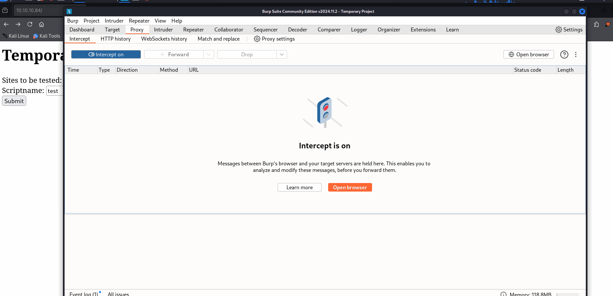

# Poison 
```markup
Date: 2025-03-20
Platform: HackThebox
Category: Linux
Difficulty: Medium
Status: Pwned (using Writeup)
IP: 10.10.10.84
Duration: 2 hours
Author: Nguyen Nghia Hiep
```

## Introduction 
Poison is a box that host a website that contains a Local File Inclusion vulnerability allowing attacker to read any files. Exploiting this vulnerability allows attacker to gain foothold onto the system where it contains a secret file. This secret file is the authentication file for a root running local service which when interact with allows for privilege escalation.
### Improved Skills:
- Log Poisoning exploitation
- Port forwarding privilege escalation
---
## Enumeration
Nmap scan reveals ssh (22) and http (80):

### Port 80 - HTTP Website
The website:

Submitting the files seems to display the content of that file at /browse.php endpoint. Attempting listfiles.php we can see the files:


Seeing this I tested for LFI, which the site is vulnerable to:


---
## Exploitation 
### LFI - File Read -> charix
Using LFI and reading the /etc/passwd file, we can see two valid user accounts: root & charix. We also found the pwdbackup.txt file:

The password seems to be Base64 encoded, decoding it reveals the password **'Charix!2#4%6&8(0'**

We have user 'charix' which the password also has the word in it. With this credential attempting to ssh as user 'charix' gives user a connection: 

### LFI - Log Poisoning -> www-data
From the Nmap scan we know that the server is using Apache, we can attempt to find its' log file /var/log/httpd-access.log

The log file is displayed, here changing the user agent will and adding an additional URL parameter we can attempt to poison the log:


---
## Post Exploitation 
#### Upgrading the Shell
We can take the various steps to upgrade our shell.
The first thing to make our job much more efficient is to upgrade the shell.
```bash
python -c 'import pty; pty.spawn("/bin/bash")'
export TERM=xterm (allow functionality like clear)
Ctrl + Z
stty raw -echo; fg
```
### Enumeration
Within the home directory we found the secret.zip file, downloading it we can use the same password **'Charix!2#4%6&8(0'** to extract the file.

The file doesn't seem to provide any information:

It was at this point that I was stuck; what I was suppose to find was a locally running service at port 5801 & 5901 (which are VNC ports):

Viewing the process 'vnc' we can see the process is being ran as **root** and contains the command that was ran:

The command that was ran here is:
```bash
Xvnc :1 -desktop X -httpd /usr/local/share/tightvnc/classes -auth /root/.Xauthority -geometry 1280x800 -depth 24 -rfbwait 120000 -rfbauth /root/.vnc/passwd -tfbport 5901 -localhost -nolisten tcp :1
```
When I pasted the command in ChatGPT, and the command reveals to be running a Xvnc on screen 1 with the name X some adjustment to the width and layout, using .Xauthority to authenticate with a file in /root/.vnc/passwd, running on localhost port 5901. VNC is like a Linux Remote Management Protocol.. We have the **'secret'** file, maybe that could be used as authentication.
### Privilege Escalation: Port forwarding VNC -> root
Using `proxychain` I set up a dynamic port forward, so that all the ports on the remote victim can interact with my own and vice-versa (SOCKS proxy on port 9050)

I then use `vncviewer` and `proxychain` to authenticate to the service on port 5901:


---
## Trophy and Loot

1. Credential: charix : Charix!2#4%6&8(0
2. user.txt: eaacdfb2d141b72a589233063604209c
3. root.txt: 716d04b188419cf2bb99d891272361f5

---
## Findings
- The website is vulnerable to LFI and can lead to RCE.
- The password stored in the file is easy to decrypt allowing for a valid ssh session.
- Secret.zip is stored on '**charix**' home directory and the password to extract the file is the same password as the ssh password.
- Xvnc service is ran as root and can lead to privilege escalation.
## Lesson Learnt
Poison is the box that teaches me about LFI -> RCE through Log Poisoning. It also teaches idea to enumerate the local system ports, researching about the services and then port forwarding using tools like `proxychains` to privilege escalate. Credits to **0xdf** [1] & **Ippsec** [2] for their writeup and video showing the Log Poisoning vector and the Privilege escalation.

## References
[1] 0xdf. "HTB: Poison" (accessed 23th March 2025). 0xdf hacks stuff. [Online]. Available: https://0xdf.gitlab.io/2018/09/08/htb-poison.html

[2] IppSec. "HackTheBox - Poison" (accessed 23th March 2025). YouTube. [Online]. Available: https://www.youtube.com/watch?v=rs4zEwONzzk